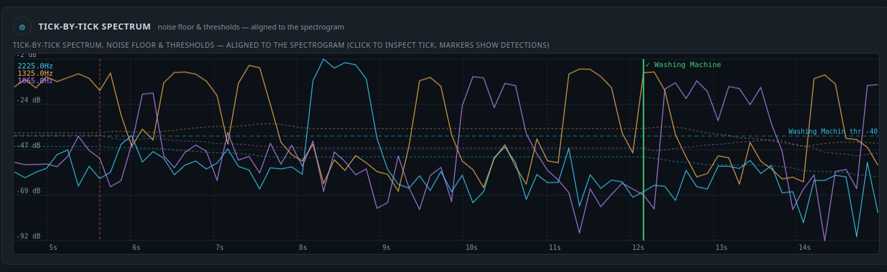
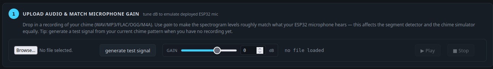
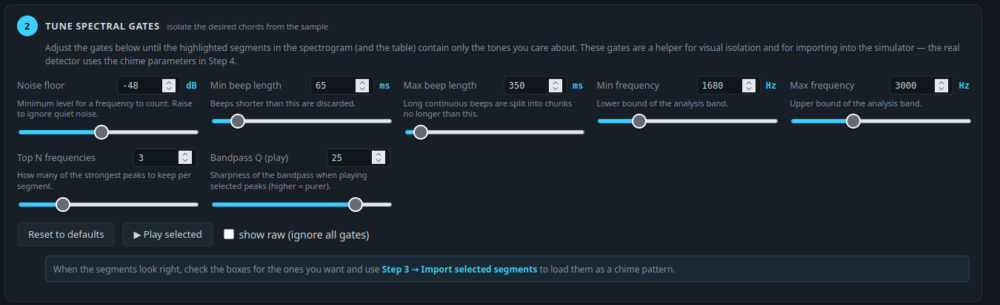
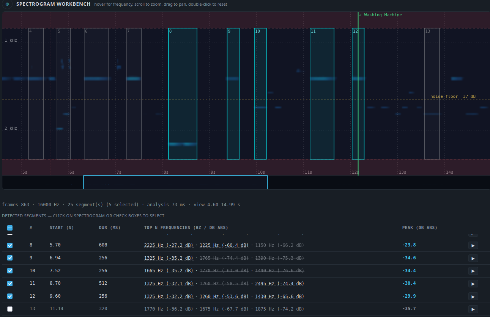
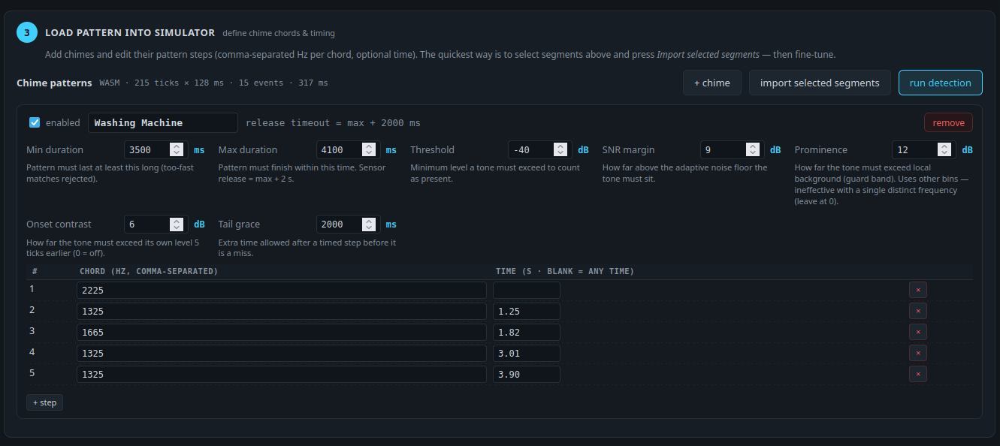
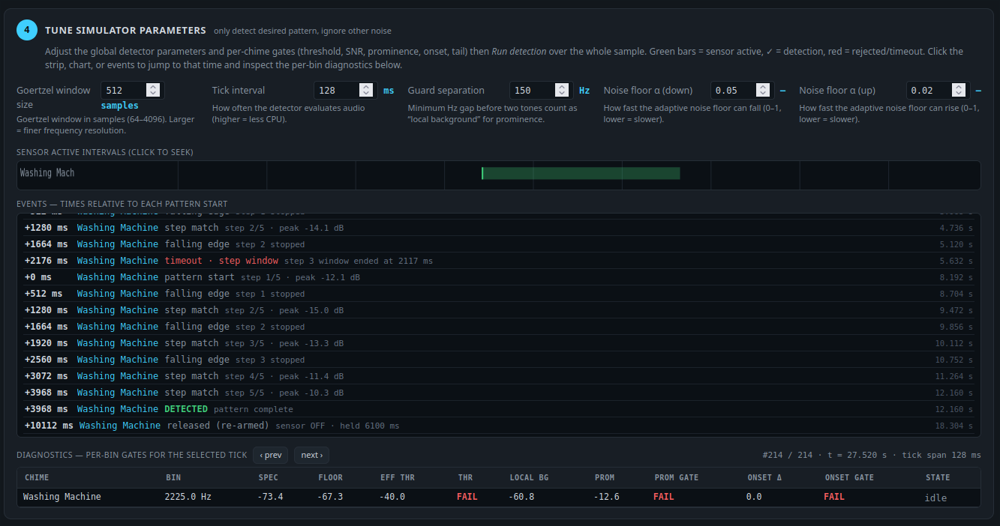

# ESPHome Tone Tools

A collection of ESPHome components for **audio analysis on ESP32 with 16-bit microphones**. Bring your dumb chimes and alarms into Home Assistant!

> **Try the simulator:** **https://ljaffy.github.io/esphome-tone-tools/** — upload a recording, tune your detector, and export a ready-to-paste `chime:` YAML block. The simulator runs the same detection engine as the ESP32 firmware, so results on the page match the device.



## Components

| Component | Purpose | ESP entity |
|-----------|---------|------------|
| `chime` | Detect 1–8 independent timed tone/chord sequences, each with its own pattern and binary sensor. Shared deduplicated Goertzel bank. | `binary_sensor` (1 per `chimes` entry) |
| `frequency` | Detect the dominant frequency in a band and publish Hz + level. Source-agnostic: `microphone:` or `adc:` (pipe/piezo). | `sensor` (`frequency` / `peak_magnitude`) |

Both require ESP32 + a sample source (`microphone:` 16-bit or `adc:` pin) at 16-bit-equivalent. Only `chime` is covered by the simulator; `frequency` is standalone. Both share the same `dsp/` Goertzel + `SampleSource` abstraction.

### Installation

```yaml
external_components:
  - source: github://ljaffy/esphome-tone-tools@main
    components: [chime, frequency]
    refresh: 0h

microphone:
  - platform: i2s
    id: i2s_mic
    # sample_rate, bits_per_sample: 16, etc.
```

---

## `chime` — Timed Tone-Sequence Detector

Replaces the legacy `tone_sequence` component. A single `chime:` block can host **1–8 chimes**. All share one microphone and one deduplicated Goertzel filter bank covering the union of every frequency in every pattern.

### Pattern model

- **2–32 steps** per chime, each step is a **chord** of **1–8 frequencies** (`chord: [440Hz, 880Hz]`). A single entry is a plain tone.
- Optional **`time`** per step in seconds (`0`–`3600`). If any times are set, timed steps must be **strictly increasing** among themselves; unconstrained steps (`time` omitted) match at any time after the previous step.
- **Chord presence** = every frequency in the chord simultaneously passes **all** gates (see below). Timed steps are only accepted inside their allowed window derived from `tail_grace`.

### How matching works

1. **Start:** when the first chord is present, a pattern attempt begins.
2. **Falling edge:** after each step matches, the detector waits for that chord to stop before the next step can be accepted. This enforces the silence between beeps (at least one `tick_interval`). If the previous chord is a subset of the next (e.g. `[440]` → `[440, 880]`), the wait is skipped.
3. **Timed vs. free steps:** a timed step only matches after its `time` has elapsed; if its window expires without a match, the attempt is discarded. Free steps match as soon as they appear.
4. **Completion:** when all steps have matched, the total elapsed time is checked against `duration.min` / `duration.max`. Too fast → rejected; within window → the binary sensor latches to `true`.
5. **Latching:** on success the sensor stays `true` for `duration.max + 2s`, then returns to `false` automatically. A repeating alarm re-triggers and extends the hold.

### Detection gates (per chime)

A frequency counts as present only if **all** enabled gates pass:

| Gate | Config key | Default | Meaning |
|------|-----------|---------|---------|
| Hard threshold | `threshold` | `-50 dB` | Absolute level must be above this. |
| Adaptive noise floor | `snr_margin_db` | `8 dB` | Must be this far above the per-bin background noise floor (floor adapts quickly to silence, slowly to loud sounds; busy bins are frozen while a pattern is active). |
| Prominence | `prominence_db` | `0 dB` *(disabled)* | Must stand out from other tones by this much. Uses the quietest *other* bin at least `guard_separation_hz` away as reference. With only one distinct frequency in the entire `chime:` block there is no other bin to compare against — prominence is always ~0 dB and the check is ineffective. Leave at `0` for single-tone detectors; raise only for multi-tone/chord patterns to reject broadband noise. |
| Onset contrast | `onset_contrast_db` | `8 dB` (`0` = off) | Must be louder than it was 5 ticks ago — helps ignore continuous tones. |

### Component-level options

| Option | Type | Default | Notes |
|--------|------|---------|-------|
| `microphone` | microphone source (16-bit) | **required** |  |
| `passive` | `bool` | **required** | `true` = never start/stop the mic; `false` = component owns the mic lifecycle. |
| `window_size` | `64–4096` | `1024` | Goertzel window in samples. Larger = finer frequency resolution + more CPU. |
| `tick_interval` | `64ms–5s` | `100ms` | How often audio is evaluated. |
| `guard_separation_hz` | `10–1000` | `150` | Minimum separation for prominence calculation. |
| `noise_floor_alpha_down` | `0.0001–1` | `0.05` | How fast the noise floor adapts downward. |
| `noise_floor_alpha_up` | `0.0001–1` | `0.005` | How fast it adapts upward (kept slow so tones don't pull it up). |
| `chimes` | `list 1–8` | **required** | See below. |

### Per-`chimes` entry

Each entry **is** a `binary_sensor`, so `name`, `id`, `filters`, `on_press`, etc. all work.

| Field | Type | Default | Notes |
|-------|------|---------|-------|
| `pattern` | `list 2–32` of `{chord, time?}` | **required** | `chord: [freq, …]` with 1–8 frequencies (`440Hz`, `2kHz`, …). `time: 1.5` optional seconds. |
| `duration` | `{min, max}` | **required** | Validated `min ≤ max`. `max + 2s` becomes the sensor hold time. |
| `threshold` | `-80–0 dB` | `-50` |  |
| `snr_margin_db` | `0–60` | `8` |  |
| `prominence_db` | `0–60` | `0` | Disabled by default. See note above — ineffective with a single distinct frequency. |
| `onset_contrast_db` | `0–30` | `8` | Set `0` to disable. |
| `tail_grace` | `time` | `2s` | Extra allowance after the last timed step before it times out. |
| *binary_sensor keys* |  |  | e.g. `name: "Doorbell"` |


### Automations

```yaml
on_...:
  then:
    - chime.start: my_chime   # ignored with a warning in passive mode
    - chime.stop:  my_chime
```

---

## `frequency` — Dominant Frequency Sensor (source-agnostic)

Publishes the loudest frequency in a band each `measurement_duration` window. Accepts exactly one source: `microphone:` (acoustic) or `adc:` (mechanically-coupled pipe/piezo, `pin`/`attenuation`/`sample_rate` 4k–48k/`adc_gain`).

| Option | Type | Default | Notes |
|--------|------|---------|-------|
| `microphone` | microphone source (16-bit) |  | XOR with `adc`. |
| `adc` | `pin`, `attenuation`, `sample_rate`, `adc_gain` |  | XOR with `microphone`. See `chime` ADC docs. |
| `passive` | `bool` | **required** | `true` = never start/stop source; `false` = owns lifecycle (both mic/ADC). |
| `window_size` | `64–4096` | `1024` |  |
| `min_frequency` | `frequency` | `100Hz` |  |
| `max_frequency` | `frequency` | `12000Hz` | Band upper bound. `min < max` required. |
| `threshold_db` | `-80–0 dB` | `-50` | Only publish if peak ≥ threshold. |
| `measurement_duration` | `50ms–60s` | `1000ms` |  |
| `frequency` | `sensor` | optional | Dominant frequency in Hz. |
| `peak_magnitude` | `sensor` | optional | Peak level in dB. |

At least one of `frequency` / `peak_magnitude` is required. Automations `frequency.start` / `stop` (passive-aware). Pure DSP lives in `frequency/frequency_engine.h` (like `chime/chime_engine.h`) and shares `dsp/goertzel.h` + `dsp/sample_source`.

---

## Simulator workflow — https://ljaffy.github.io/esphome-tone-tools/

The simulator is a single page that walks you from a raw recording to a working `chime:` config in 5 steps. Use the sticky stepper at the top to jump between steps.


### Step 1 — Upload audio & match microphone gain

Upload a recording of the chime or alarm you want to detect (WAV, MP3, FLAC, OGG, M4A, WEBM all work).

- Use the **Gain** slider (−48 dB to +24 dB) to make the levels on the page match what the ESP32 microphone hears. This affects both the spectrogram and the detector, so get it roughly right first.
- Use **Play / Stop** to preview the file.
- If you don't have a recording yet, click **Generate test signal** — it synthesizes a short example from your current chime pattern so you can test the flow immediately.



### Step 2 — Tune spectral gates (visual helper)

These controls only affect what you *see* on the spectrogram and which segments are offered for import — they don't change the real detector.

Adjust noise floor, beep length limits, frequency band, and how many peaks to keep until the highlighted segments on the spectrogram contain only the tones you care about. Toggle **Show raw** to bypass the gates and see the unfiltered signal, or **Play selected** to hear just the chosen tones.

When the segments look right, select the ones you want (click on the spectrogram or use the checkboxes in the table) — you'll import them in the next step.



### Spectrogram workbench

Between steps 2 and 3 is the interactive spectrogram:

- Log-frequency axis, time on the horizontal axis. Zoom with the mouse wheel, drag to pan, use the minimap at the bottom to jump around, or double-click to reset.
- Hover to read time / frequency / level.
- The table below lists every detected segment with its start time, duration, top frequencies and peak level. Selected segments are highlighted on the spectrogram.



### Step 3 — Load pattern into simulator

Define your chime patterns here. Each card is one chime (binary sensor):

- Set the **name**, whether it's **enabled**, and edit the pattern steps as comma-separated frequencies per chord (e.g. `440, 880`) with an optional time in seconds (leave blank for "any time").
- Add or remove chimes and steps with **+ chime** / **+ step**.

The fastest way to start is **Import selected segments** — it takes the segments you selected in the workbench and creates a pattern with one step per segment, timed relative to the first. Then fine-tune frequencies and times by hand.



### Tick-by-tick spectrum

Between Pattern and Simulate is the tick-by-tick spectrum chart, aligned to the spectrogram's time axis:

- Per-bin level traces, adaptive noise floors, and per-chime threshold lines.
- **Matched chimes are shown in both places:** the spectrogram and the spectrum chart get a green `✓` line at each detection (and red dashed lines for rejected/timeout attempts), so you can correlate acoustic energy with detector decisions.
- Click on the chart (or the spectrogram markers) to jump to that tick and inspect the diagnostics.


### Step 4 — Tune simulator parameters and run detection

This is where the real detector is tuned. Adjust the global and per-chime gate parameters, then click **Run detection**:

- **Global:** Goertzel window size, tick interval, guard separation, and the two noise-floor adaptation speeds. These are the same keys that appear in the ESPHome YAML.
- **Per-chime:** threshold, SNR margin, prominence, onset contrast, tail grace, and expected `min`/`max` duration. Tooltips explain each.

Results appear immediately:

- **Sensor strip** — green bars show when each binary sensor would be active. Click to jump to that time.
- **Events** — a log of pattern starts, step matches, falling edges, detections, and rejections/timeouts (with how long the attempt took). Click any event to jump to it.
- **Diagnostics** — per-tick, per-frequency breakdown of which gates passed or failed and the detector's current state (idle, waiting for next step, awaiting falling edge, latched).

Keep adjusting gates and re-running until the simulator fires only on the desired pattern and ignores background noise.



### Step 5 — Export ESPHome YAML

When you're happy with the results, the page shows a complete `chime:` block that updates live as you tune:

```yaml
chime:
  microphone: mic1   # <-- replace with your mic ID
  passive: true
  window_size: 1024
  tick_interval: 100ms
  guard_separation_hz: 150
  noise_floor_alpha_down: 0.05
  noise_floor_alpha_up: 0.005
  chimes:
    - name: "Doorbell"
      pattern:
        - chord: [440Hz, 880Hz]
        - chord: [660Hz, 1320Hz]
          time: 0.5
      duration:
        min: 2000ms
        max: 5000ms
      threshold: -50.0
      snr_margin_db: 8.0
      prominence_db: 0.0
      onset_contrast_db: 8.0
      tail_grace: 2000ms
```

Click **Download YAML** to save it, paste it into your ESPHome config, replace `mic1` with your microphone ID, and flash. The device will behave the same as the green detections you saw in the simulator.

<!--  -->

---

## Example configuration

```yaml
external_components:
  - source: github://ljaffy/esphome-tone-tools@main
    components: [chime, frequency]
    refresh: 0h

microphone:
  - platform: i2s
    id: i2s_mic
    # ... microphone config ...

chime:
  microphone: i2s_mic
  passive: true
  window_size: 1024
  tick_interval: 100ms
  guard_separation_hz: 150
  noise_floor_alpha_down: 0.05
  noise_floor_alpha_up: 0.005
  chimes:
    - name: "Alarm Bell"
      pattern:
        - chord: [440Hz, 880Hz]
        - chord: [660Hz, 1320Hz]
          time: 0.6
        - chord: [440Hz, 880Hz]
          time: 1.2
      duration:
        min: 1000ms
        max: 3000ms
      threshold: -50
      snr_margin_db: 8
      prominence_db: 6
      onset_contrast_db: 8
      tail_grace: 2000ms
      on_press:
        then:
          - logger.log: "Alarm detected!"

    - name: "Microwave"
      pattern:
        - chord: [2000Hz]
        - chord: [2000Hz]
        - chord: [2000Hz]
      duration:
        min: 3000ms
        max: 5000ms
      threshold: -55

frequency:
  microphone: i2s_mic
  passive: true
  window_size: 1024
  min_frequency: 100Hz
  max_frequency: 8000Hz
  threshold_db: -50
  measurement_duration: 1s
  frequency:
    name: "Dominant Frequency"
  peak_magnitude:
    name: "Peak Level"

# ADC example (mechanically-coupled pipe/piezo) – works for both chime and frequency:
# frequency:
#   adc:
#     pin: GPIO4
#     attenuation: 11db
#     sample_rate: 16000
#     adc_gain: 4
#   passive: false
#   window_size: 1024
#   min_frequency: 100Hz
#   max_frequency: 2000Hz
#   frequency:
#     name: "Pipe Frequency"
```

## License

MIT — see [LICENSE](LICENSE).
